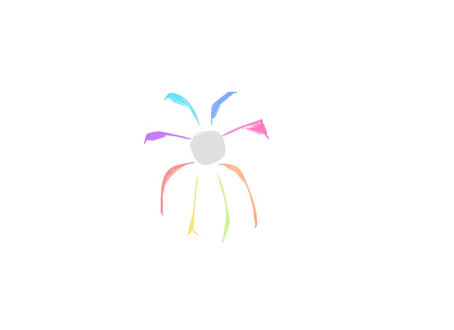

# Viz-Crawler
## Tableau Hackathon Project

"The purpose of art is washing the dust of daily life off our souls"... Always draw a logo for your project :) 

## Set up 
### 1. Install Headless Chrome and run:

```
chrome --headless --disable-gpu --remote-debugging-port=9222 https://public.tableau.com/en-us/s/gallery
```